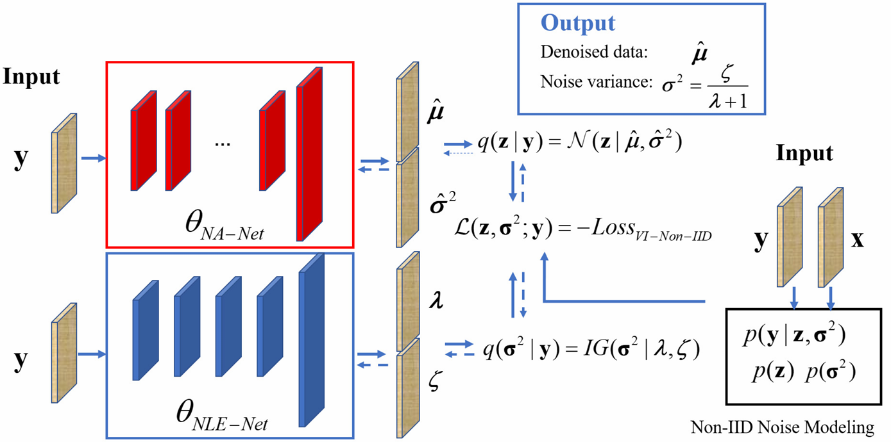
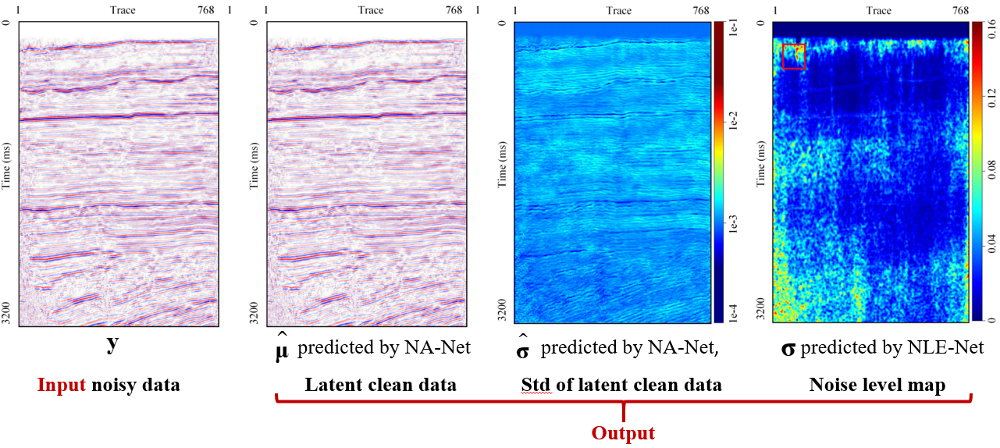

# Seismic random noise attenuation based on non-IID pixel-wise Gaussian noise modeling
# Requirements and Dependencies
* Ubuntu 16.04, cuda 10.0
* Python 3.6, Pytorch 1.1.0
* More detail (See environment.yml)
* Training and testing can also be performed on Windows systems.

## Schematic diagram of the VI-non-IID framework
VI-non-IID framework



The input and output of VI-non-IID.


 

**Note**:
----------------------------------------------------------------------------------------
The predicted noise level map is very useful for analyzing the characteristics of the field seismic noise. Feel free to try it, it's very easy. Users can also use it to directly estimate the noise level of their own data, which is an important parameter for some denoising or noisy inversion algorithms, see [PS-SGMs](https://github.com/mengchuangji/PS-SGMs-seismic) for an example.
At the same time, VI-non-IID is also a blind deep denoiser tailored for seismic data, so it can also provide denoiser priors (of seismic data) for some algorithms that require the addition of seismic data priors, see [SRNGF](https://github.com/mengchuangji/SRNGF) for an example.

## Datasets
- you own **.segy** or **.sgy** seismic data or you can download some **.segy** or **.sgy** data online by the code we provide
- you can use the Marmousi model to calculate the reflection coefficients, then we use reflection coefficients and the Ricker wavelet with a different dominant frequency(e.g. 35Hz) and different phase(e.g. 0) to synthesize the clean data of the training set.
- the model we provided is trained with Marmousi or/and [Open data] 
("http://s3.amazonaws.com/open.source.geoscience/open_data/bpmodel94/Model94_shots.segy.gz",
        "http://s3.amazonaws.com/open.source.geoscience/open_data/bpstatics94/7m_shots_0201_0329.segy.gz",
        "https://s3.amazonaws.com/open.source.geoscience/open_data/bp2.5d1997/1997_2.5D_shots.segy.gz",
        "http://s3.amazonaws.com/open.source.geoscience/open_data/bpvelanal2004/shots0001_0200.segy.gz",
        "http://s3.amazonaws.com/open.source.geoscience/open_data/bptti2007/Anisotropic_FD_Model_Shots_part1.sgy.gz",
        "https://s3.amazonaws.com/open.source.geoscience/open_data/hessvti/timodel_shot_data_II_shot001-320.segy.gz",
        "http://s3.amazonaws.com/open.source.geoscience/open_data/Mobil_Avo_Viking_Graben_Line_12/seismic.segy")
- More detail about generating sample data from .segy seismic data for deep learning based on pytorch (see [python_segy](https://github.com/sevenysw/python_segy)).

## Generating training data
### 
[comment]: <> ()

### Seismic Data Training with Synthesis Noise  (when  clean labels (groundtruth) are unavailable)

1. Download the seismic from the above links and synthesize the clean data using the Marmousi model
   
2. Prepare the testing datasets with different Non-IID noise coming from seismic feild data:
```
    python datasets/mat/generate_niid_noise_from_field.py
```
3. Begining training:
```
    python train_NonIID-Unet_with_SynthesisSample --simulate_dir source_imgs_path --eps2 1e-6
```

## Seismic field data training when clean labels (groundtruth) are available

### Training:

1. Writing the training and validation datasets into hdf5 fromat:
```
    python datasets/prepare_data/segy/big2small_seismic_train.py --data_dir field_data_path
    python datasets/prepare_data/segy/big2small_seismic_test.py --data_dir field_data_path
```
2. Begin training:
```
    # model: NonIID-Unet recommended
    python train_NonIID-Unet_with_LabeledSample.py --SIDD_dir sidd_data_path --eps2 1e-6
    # model: NonIID-DnCNN
    python train_NonIID-DnCNN_with_LabeledSample.py --SIDD_dir sidd_data_path --eps2 1e-6
```

### During the testing phase, we provide the corresponding trained model.

### Testing VI-Non-IID model if the reference clean label of test data is unavailable
Here, test your arbitrary data. Our model can simultaneously output noise attenuation results and corresponding noise level estimation (sigma) map.
```
    # you can choose NonIID-Unet (recommended) or  NonIID-DnCNN
    python test_NonIID_Model_on_SEGY-field-noisy-data.py
    
    #baseline      model can be Unet or DnCNN
    python test_MSE_Model_on_SEGY-field-noisy-data.py
    
```

### Testing if the reference clean label of test data is available
```
    # you can choose NonIID-Unet (recommended) or  NonIID-DnCNN
    python test_NonIID_model_CompareWithLabel.py 
    
    # baseline
    python test_MSE-model_CompareWithLabel.py
    
    
```

### Testing on synthesis Non-IID noise
```
    # you can choose VI-NonIID-Unet or VI-NonIID-DnCNN
    python test_NonIID_model_on_Synthesis_IID-or-NonIID_noise.py
    
    # Baseline
    python test_MSE-model_on_Synthesis_IID-or-NonIID_noise.py
    
```
### A note about field data
```
Since the field data is provided by commercial companies, it is not convenient to make it public. Users can directly replace it with their own data. 
```
### More Description 
```
The readsegy function can be modified based on your own data. Any other users confused about this function can contact the author directly.
```
## Citation
If you use this code for your research, please consider citing:
```    
@article{meng2022seismic,
  title={Seismic random noise attenuation based on non-IID pixel-wise Gaussian noise modeling},
  author={Meng, Chuangji and Gao, Jinghuai and Tian, Yajun and Wang, Zhiqiang},
  journal={IEEE Transactions on Geoscience and Remote Sensing},
  volume={60},
  pages={1--16},
  year={2022},
  publisher={IEEE}
}
    
```

## Contact
If you have any problem about our code, feel free to contact 
- 4120105144@stu.edu.xjtu.cn
or describe your problem in Issues.
